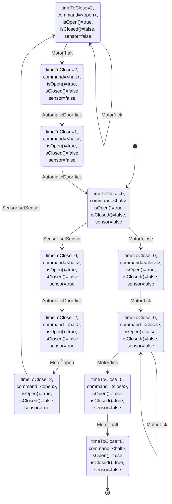

For Overture 24

```mermaid
stateDiagram
  state "timeToClose=0,
command=&lt;close&gt;,
isOpen()=false,
isClosed()=false,
sensor=false" as s9
  state "timeToClose=2,
command=&lt;open&gt;,
isOpen()=true,
isClosed()=false,
sensor=false" as s5
  state "timeToClose=2,
command=&lt;open&gt;,
isOpen()=true,
isClosed()=false,
sensor=true" as s4
  state "timeToClose=2,
command=&lt;halt&gt;,
isOpen()=true,
isClosed()=false,
sensor=false" as s6
  state "timeToClose=0,
command=&lt;close&gt;,
isOpen()=false,
isClosed()=true,
sensor=false" as s10
  state "timeToClose=2,
command=&lt;halt&gt;,
isOpen()=true,
isClosed()=false,
sensor=true" as s3
  state "timeToClose=0,
command=&lt;halt&gt;,
isOpen()=false,
isClosed()=true,
sensor=false" as s11
  state "timeToClose=0,
command=&lt;close&gt;,
isOpen()=true,
isClosed()=false,
sensor=false" as s8
  state "timeToClose=1,
command=&lt;halt&gt;,
isOpen()=true,
isClosed()=false,
sensor=false" as s7
  state "timeToClose=0,
command=&lt;halt&gt;,
isOpen()=true,
isClosed()=false,
sensor=false" as s1
  state "timeToClose=0,
command=&lt;halt&gt;,
isOpen()=true,
isClosed()=false,
sensor=true" as s2
  [*] --> s1
  s1 --> s2 : Sensor`setSensor
  s2 --> s3 : AutomaticDoor`tick
  s3 --> s4 : Motor`open
  s4 --> s5 : Sensor`setSensor
  s5 --> s5 : Motor`tick
  s5 --> s6 : Motor`halt
  s6 --> s7 : AutomaticDoor`tick
  s7 --> s1 : AutomaticDoor`tick
  s1 --> s8 : Motor`close
  s8 --> s9 : Motor`tick
  s9 --> s9 : Motor`tick
  s9 --> s10 : Motor`tick
  s10 --> s11 : Motor`halt
  s11 --> [*]
```
